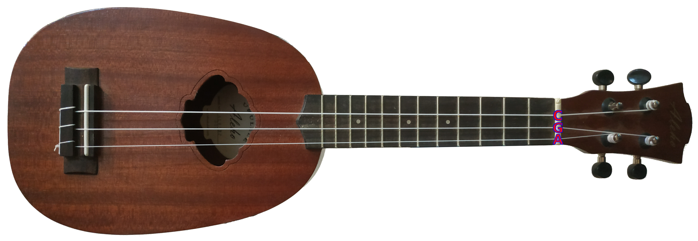

# Uku3le
## C4 G4 A4
### Eyal Gruss and Ayelet Sapirshtein
#### For Daniel Johnston

A simpler 3-string tuning for ukulele.

Play 25% of songs - with only 2 fingers!

We optimized a ukulele tuning to allow playing chords for a maximum number of songs with a minimum number of fingers, 
and trying to give the more important chords the easier fingerings. We do not allow barres nor muted strings. 
Chord importance is determined not by prevalence, but by the number of complete songs they playing given the other chords. 
This is a version of the [densest k-subhypergraph problem](https://arxiv.org/abs/1605.04284), which we solve by brute force. 
Our solution uses data of 20,000 most popular rock, pop, folk and country songs from 1960 to date, 
scraped from [Ultimate Guitar](https://www.ultimate-guitar.com). 
The scraper is based on [Ljfernando's Progressions repo](https://github.com/Ljfernando/Progressions), 
and the analysis is made possible by [pychord](https://github.com/yuma-m/pychord). 
Different from most analyses, we do not normalize the data by transposition as we want to allow users to play songs in 
their original form (Pink Floyd's "In the Flesh?" starts with an A!), we do not want to a degenerate songs with scale shifts, 
and we do not want to require the user to do transpositions. We are however lax about chord voicings and inversions. 
We hope this system may help children, perplexed beginners, people with disablities and the dexterity-challenged to play strings.

 

.svg)

.svg)

.svg)

.svg)

Here are the most important missing chords requiring 3 fingers:

Charts by [Chordious](https://chordious.com).

A [Geekcon+2019](https://geekcon.org/geekcon-plus-2019) project.
