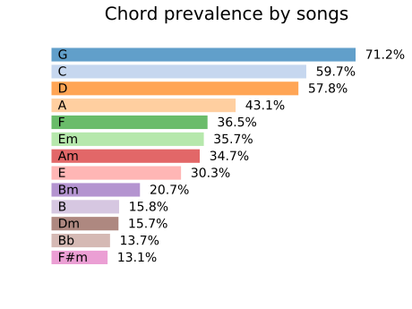

# Uku3le
## C4-G4-A4
### Eyal Gruss and Ayelet Sapirshtein
#### For Daniel Johnston

A simpler 3-string tuning for ukulele.

Play 25% of songs - with only two fingers!

We optimized a ukulele tuning to allow playing chords for a maximum number of songs with a minimum number of fingers, 
and trying to give the more important chords the easier fingering. We do not allow barres nor muted strings. 
Chord importance is determined not necessarily by prevalence, but by the number of complete songs they allow playing given the other chords.
This is an optimization problem called [densest k-subhypergraph](https://arxiv.org/abs/1605.04284), which we solve by brute force.  

A [hypergraph](https://en.wikipedia.org/wiki/Hypergraph) is a generalization of a graph, having hyperedges that connect any number of nodes. 
In this reperesentation chords are nodes, and songs are hyperedges. For a given number of k chords, we want to find the specific chords that 
induce a subhypergraph containing a maximal number of songs. For example, in the diagram below, the solution for k=3 is C, D, G; covering song I and II.    
 

For example, the 6 most prevalent chords, counting songs are: C, D, F, G, Em, A. The 6 most prevalent chords, counting chord instances are: C, D, F, G, Am, A.
And the 6 most important chords, that is the 6 chords that allow playing the maximal number of complete songs are: C, D, F, G, Em, Am.
Which makes sense for the latter as this is just the combination of the chords of the [most popular](http://www.hooktheory.com/blog/music-theory-analysis-1300-songs-for-songwriting-part2) 
I-V-vi-IV progression for the [most popular](http://www.hooktheory.com/blog/i-analyzed-the-chords-of-1300-popular-songs-for-patterns-this-is-what-i-found) C major (C-G-Am-F) and G major (G-D-Em-C) scales.
Our tuning primarily strives to simplify these latter 6 chords.

**Previous work:** For guitar, one has the open tunings, e.g. open G (D2-G2-D3-G3-B3-D4) and open D (D2-A2-D3-F#3-A3-D4).
An open strum will give G and D respectively, and all other major chords can be played with a full barre (holding all strings down with one finger), on each of the frets. 
For the open D tuning, one could also barre and strum just the top two or three strings to get all two-note "power chords" (designated C5, D5 etc.). 
Note that these methods require the use of 11 frets.  
For the ukulele, Douglas Reynolds has suggested the ["One Finger Ukulele"](https://playuke.net/one-finger-ukulele) system using a C2-G2-C3-G3 tuning. 
The idea is to use a full barre to play only power chords, as a substitute for the common major, minor, 7th, minor 7th, etc. chords. 
Reynold's suggests this tuning will work for a baritone ukulele or for a tenor ukulele with a change of strings, but not for the most common smaller soprano ukalele.  
Finally, the standard soprano ukulele tuning: G4-C4-E4-A4, already offers a nice selection of easy chords: Am7 - is the open strum; 
C, C7, Am and A7 - use only one finger; Em7, F, and A - two fingers on the same or consecutive frets. All without barre or muted strings. 
This, in fact, is what led us to the idea that we may be able to do better! 

**Data:** We scraped 19,358 most popular rock, pop, folk and country songs from 1960 to date, 
from [Ultimate Guitar](https://www.ultimate-guitar.com), by querying the top 1000 "hits" for each genre and decade combination. 
The scraper is based on [Ljfernando's Progressions repo](https://github.com/Ljfernando/Progressions), 
and the analysis is made possible by [pychord](https://github.com/yuma-m/pychord).  
Different from most analyses, we do not normalize the data by transposition - changing the scale, as we want to allow users to play songs in 
their original form (Pink Floyd's "In the Flesh?" starts with an A!), we do not want to a degenerate songs with key shifts, 
and we do not want to require the user to do transpositions. However, in our optimization we were indifferent to the chord voicing - the octave choices for each note in the chord,
including chord inversions - change of the root note.

**Results:** Our optimization suggeted sacrificing the top string and tuning the three bottom ones to C-G-A. 
Considering the use of up to two fingers, our tuning allows playing 22.9% of songs having up to 4-note chords and 41.8% of songs having up to 3-note chords, 
as compared to 0.3% and 0.4% respectively for the standard G-C-E-A tuning.  
The above assumes we forgo the 4-note chords. However, we could instead simplify them to incomplete versions with 3 notes. 
We will do so by dropping the "fifth" interval, which is the third note of the chord. We denote these simplified chords with an asterisk (\*). 
An open strum gives Am7* similar to the standard tuning. This brings us up to 28% of songs having up to 4-note chords. Booyah!  
We do pay an additional price of needing to utilize the 7 first frets to play these chords, and some other 3-note chords would require even higher frets.  
The solution has some degrees of freedom concerning the string order and choice of octaves. However, other considerations such as proper string tension without changing strings, suggested that we fix the tuning to C4-G4-A4, 
which is close to the bottom three of the standard G4-C4-E4-A4. Following are the chord charts for 28 popular chords requiring up to two fingers and a reach difference of up to two frets.

We hope this system may help children, beginners with difficulties, people with disabilities and the dexterity-challenged (including the first author) to play strings.

 

.svg)

.svg)

.svg)

.svg)

.svg)

.svg)

.svg)

Here are the most important missing chords requiring up to three fingers and up to a reach difference of three frets:

Chord charts by [Chordious](https://chordious.com).

Some statistics (no transpositions, respect chord voicings, no limit on number of notes in chord):

A [Geekcon+2019](https://geekcon.org/geekcon-plus-2019) project.
